# 🔐 Confidential Fundraising Platform

A privacy-preserving decentralized fundraising platform built with **FHEVM (Fully Homomorphic Encryption Virtual Machine)**. Contributors can support campaigns while keeping their contribution amounts completely private, with only authorized parties able to decrypt sensitive information.

---

## 📖 Concept

The Confidential Fundraising Platform revolutionizes crowdfunding by combining blockchain transparency with **cryptographic privacy**. Traditional fundraising platforms expose all contribution amounts publicly, which can influence donor behavior and compromise privacy. Our solution leverages **homomorphic encryption** to keep contribution amounts encrypted on-chain while still enabling mathematical operations like summing total contributions.

### Key Features

- **🔒 Private Contributions**: All contribution amounts are encrypted using FHEVM technology
- **🎯 Goal-Based Campaigns**: Campaigns have targets and deadlines
- **🪙 Token Rewards**: Successful campaigns distribute ERC20 tokens proportionally to contributors
- **💰 Automatic Refunds**: Failed campaigns automatically refund contributors
- **🔐 Secure Escrow**: ShareVault contract manages all funds with encrypted balance tracking
- **⚡ Client-Side Decryption**: Instant decryption without waiting for blockchain callbacks
- **🎭 Zero-Knowledge**: Campaign totals remain private until authorized decryption

---

## 🏗️ Architecture Overview

The platform consists of three main layers: **Smart Contracts** (on-chain logic), **Frontend Application** (user interface), and **FHEVM Layer** (encryption/decryption).

```mermaid
graph TB
    subgraph "👤 User Layer"
        User[Web Browser<br/>+ Wallet]
    end

    subgraph "🎨 Frontend Layer"
        NextJS[Next.js 15 App]
        Privy[Privy Auth]
        FHEVM_SDK[Zama FHEVM<br/>Relayer SDK]
    end

    subgraph "⛓️ Blockchain Layer"
        CF[ConfidentialFundraising<br/>Contract]
        SV[ShareVault<br/>Escrow Contract]
        CT[CampaignToken<br/>ERC20]
    end

    subgraph "🔐 FHEVM Layer"
        Encrypt[Client-Side<br/>Encryption]
        Decrypt[Client-Side<br/>Decryption]
        FHE_Ops[On-Chain FHE<br/>Operations]
    end

    User <--> NextJS
    NextJS <--> Privy
    NextJS <--> FHEVM_SDK
    FHEVM_SDK <--> Encrypt
    FHEVM_SDK <--> Decrypt
    NextJS <--> CF
    NextJS <--> SV
    NextJS <--> CT
    CF <--> SV
    CF --> CT
    CF <--> FHE_Ops
    SV <--> FHE_Ops
    Encrypt --> FHE_Ops
    FHE_Ops --> Decrypt

    style User fill:#ffeb99,stroke:#333,stroke-width:3px
    style NextJS fill:#61dafb,stroke:#333,stroke-width:3px
    style CF fill:#ff6b6b,stroke:#333,stroke-width:3px
    style SV fill:#4ecdc4,stroke:#333,stroke-width:3px
    style FHEVM_SDK fill:#a8dadc,stroke:#333,stroke-width:3px
    style FHE_Ops fill:#457b9d,stroke:#333,stroke-width:3px,color:#fff
```



### Smart Contract Architecture


---

## 🔄 Application Flows

### 1. Campaign Creation Flow


### 2. Contribution Flow

```mermaid
%%{init: {'theme':'base', 'themeVariables': {'primaryColor':'#66ccff','primaryTextColor':'#000','primaryBorderColor':'#000','lineColor':'#000','secondaryColor':'#b3e5ff','tertiaryColor':'#fff','noteBkgColor':'#b3e5ff','noteTextColor':'#000','noteBorderColor':'#000','actorBkg':'#66ccff','actorBorder':'#000','actorTextColor':'#000','actorLineColor':'#000','signalColor':'#000','signalTextColor':'#000','labelBoxBkgColor':'#b3e5ff','labelBoxBorderColor':'#000','labelTextColor':'#000','loopTextColor':'#000','activationBorderColor':'#000','activationBkgColor':'#e6f7ff','sequenceNumberColor':'#000'}}}%%
sequenceDiagram
    participant U as 👤 Contributor
    participant F as 🎨 Frontend
    participant SDK as 🔐 FHEVM SDK
    participant SV as 💰 ShareVault
    participant CF as 📝 ConfidentialFundraising

    U->>F: Enter contribution amount

    alt User has insufficient vault balance
        F->>SV: deposit(ETH)
        SV->>SV: Encrypt balance on-chain
        SV->>SV: Grant FHE permissions
        SV-->>F: ✅ Deposit successful
    end

    F->>SDK: Encrypt contribution amount
    SDK-->>F: encryptedAmount + proof

    F->>CF: contribute(campaignId, encryptedAmount)
    CF->>CF: Verify campaign is active
    CF->>SV: lockFunds(user, campaignId, encryptedAmount)
    SV->>SV: Lock funds: locked[user][campaign] += amount
    SV-->>CF: ✅ Funds locked
    CF->>CF: Store encrypted contribution
    CF->>CF: Update encrypted totalRaised
    CF-->>F: ✅ Contribution successful
    F-->>U: Show success message

    Note over CF,SV: All amounts remain<br/>encrypted on-chain
```



### 3. Campaign Finalization Flow

```mermaid
%%{init: {'theme':'base', 'themeVariables': {'primaryColor':'#cc99ff','primaryTextColor':'#000','primaryBorderColor':'#000','lineColor':'#000','secondaryColor':'#e6ccff','tertiaryColor':'#fff','noteBkgColor':'#e6ccff','noteTextColor':'#000','noteBorderColor':'#000','actorBkg':'#cc99ff','actorBorder':'#000','actorTextColor':'#000','actorLineColor':'#000','signalColor':'#000','signalTextColor':'#000','labelBoxBkgColor':'#e6ccff','labelBoxBorderColor':'#000','labelTextColor':'#000','loopTextColor':'#000','activationBorderColor':'#000','activationBkgColor':'#f5ebff','sequenceNumberColor':'#000'}}}%%
sequenceDiagram
    participant U as 👤 Campaign Owner
    participant F as 🎨 Frontend
    participant SDK as 🔐 FHEVM SDK
    participant CF as 📝 ConfidentialFundraising
    participant SV as 💰 ShareVault
    participant CT as 🪙 CampaignToken

    U->>F: Click "Finalize Campaign"
    F->>F: Check deadline passed

    F->>CF: getEncryptedTotalRaised(campaignId)
    CF-->>F: encryptedTotal
    F->>SDK: Decrypt total amount
    SDK-->>F: decryptedTotal

    F->>F: Display total to owner
    U->>F: Confirm finalization<br/>(provide token name & symbol)

    F->>CF: finalizeCampaign(campaignId, tokenName, tokenSymbol)

    alt Target Reached ✅
        CF->>CT: Deploy new CampaignToken
        CT-->>CF: Token contract address
        CF->>SV: transferLockedFunds(owner, campaignId)
        SV->>SV: Calculate total locked for campaign
        SV->>SV: Unlock all contributor funds
        SV->>SV: Transfer ETH to owner
        SV-->>CF: ✅ Funds transferred
        CF->>CF: Mark campaign successful
        CF-->>F: ✅ Campaign finalized successfully
        F-->>U: "🎉 Campaign successful!<br/>Contributors can claim tokens"
    else Target Not Reached ❌
        CF->>SV: unlockFunds(campaignId)
        SV->>SV: Unlock all contributor funds
        SV-->>CF: ✅ Funds unlocked
        CF->>CF: Mark campaign failed
        CF-->>F: ❌ Campaign failed
        F-->>U: "Campaign failed.<br/>Refunds available to contributors"
    end
```



### 4. Token Claim Flow

```mermaid
sequenceDiagram
    participant U as 👤 Contributor
    participant F as 🎨 Frontend
    participant SDK as 🔐 FHEVM SDK
    participant CF as 📝 ConfidentialFundraising
    participant CT as 🪙 CampaignToken

    U->>F: Click "Claim Tokens"

    F->>CF: getEncryptedContribution(campaignId)
    CF-->>F: encryptedContribution
    F->>SDK: Decrypt contribution amount
    SDK-->>F: decryptedContribution

    F->>CF: claimTokens(campaignId)
    CF->>CF: Verify campaign successful
    CF->>CF: Calculate tokens:<br/>userTokens = (contribution / target) * MAX_SUPPLY
    CF->>CT: mint(contributor, userTokens)
    CT->>CT: Mint tokens to contributor
    CT-->>CF: ✅ Tokens minted
    CF->>CF: Mark user as claimed
    CF-->>F: ✅ Tokens claimed
    F-->>U: "🎊 Received X tokens!"

    Note over CT: Max supply: 1 billion tokens<br/>per campaign
```



### 5. Vault Balance & Withdrawal Flow

```mermaid
sequenceDiagram
    participant U as 👤 User
    participant F as 🎨 Frontend
    participant SDK as 🔐 FHEVM SDK
    participant SV as 💰 ShareVault

    rect rgb(240, 248, 255)
        Note over U,SV: Check Balance
        U->>F: View vault balance
        F->>SV: getEncryptedBalance()
        SV-->>F: encryptedBalance
        F->>SV: getEncryptedTotalLocked()
        SV-->>F: encryptedLocked

        par Decrypt Balance
            F->>SDK: Decrypt balance
            SDK-->>F: decryptedBalance
        and Decrypt Locked
            F->>SDK: Decrypt locked
            SDK-->>F: decryptedLocked
        end

        F->>F: Calculate available:<br/>available = balance - locked
        F-->>U: Show balance breakdown
    end

    rect rgb(240, 255, 240)
        Note over U,SV: Withdraw Funds
        U->>F: Enter withdrawal amount
        F->>F: Verify amount <= available
        F->>SV: withdraw(amount)
        SV->>SV: Verify sufficient balance
        SV->>SV: Update encrypted balance
        SV->>U: Transfer ETH
        SV-->>F: ✅ Withdrawal successful
        F-->>U: "✅ Withdrawal complete"
    end
```



### 6. Encryption & Decryption Flow (Technical)


---

## 🚀 Getting Started

### Prerequisites

Ensure you have the following installed:

| Technology | Version | Purpose |
|------------|---------|---------|
| **Node.js** | >= 20.0.0 | Runtime environment |
| **npm** or **yarn** | Latest | Package manager |
| **Git** | Latest | Version control |
| **MetaMask** or compatible wallet | Latest | Web3 wallet |
| **Hardhat** | ^2.22.15 | Smart contract development |
| **TypeScript** | >= 5.0.0 | Type safety |

### Technology Stack

#### Smart Contracts
- **Solidity**: 0.8.24
- **FHEVM Core Contracts**: ^0.8.0
- **FHEVM Solidity Library**: ^0.8.0
- **Zama Oracle SDK**: ^0.2.0
- **Hardhat**: Development environment
- **TypeChain**: Type-safe contract interactions
- **Ethers v6**: Web3 library

#### Frontend
- **Next.js**: 15.0.0 (App Router)
- **React**: 19.1.0
- **TypeScript**: ^5.0.0
- **Viem**: ^2.21.53 (Ethereum client)
- **Ethers**: ^6.13.4 (Provider/Signer)
- **Privy**: ^3.0.1 (Wallet authentication)
- **Zama FHEVM Relayer SDK**: ^0.2.0 (Encryption/Decryption)
- **Tailwind CSS**: ^3.4.17 (Styling)

### Installation

#### 1. Clone the Repository

```bash
git clone <repository-url>
cd confidential-fundraising
```

#### 2. Install Contract Dependencies

```bash
npm install
```

#### 3. Install Frontend Dependencies

```bash
cd fundraising-frontend
npm install
```

#### 4. Configure Environment Variables

**Root `.env` file** (for contract deployment):
```bash
# Create .env file in root directory
cp .env.example .env

# Add your configuration
PRIVATE_KEY=your_wallet_private_key
SEPOLIA_RPC_URL=https://sepolia.infura.io/v3/YOUR_INFURA_KEY
ETHERSCAN_API_KEY=your_etherscan_api_key
```

**Frontend `.env.local` file**:
```bash
# Create .env.local in fundraising-frontend/
cd fundraising-frontend
cp .env.example .env.local

# Add your configuration
NEXT_PUBLIC_CONTRACT_ADDRESS=0x... # ConfidentialFundraising contract
NEXT_PUBLIC_VAULT_ADDRESS=0x...    # ShareVault contract
NEXT_PUBLIC_CHAIN_ID=11155111      # Sepolia testnet
NEXT_PUBLIC_RPC_URL=https://sepolia.infura.io/v3/YOUR_INFURA_KEY
NEXT_PUBLIC_PRIVY_APP_ID=your_privy_app_id
```

### Development Workflow

#### Local Development with Mock FHEVM

```bash
# Terminal 1: Start local Hardhat node
npm run node

# Terminal 2: Deploy contracts to localhost
npm run deploy:localhost

# Terminal 3: Start frontend
cd fundraising-frontend
npm run dev
```

Visit `http://localhost:3000` to see the application.

#### Testing Contracts

```bash
# Run all tests
npm test

# Run tests with coverage
npm run coverage:mock

# Run specific test file
npx hardhat test test/ConfidentialFundraising.test.ts
```

#### Compile Contracts

```bash
npm run compile
```

This generates:
- Compiled artifacts in `artifacts/`
- TypeChain types in `types/`
- ABI files for frontend integration

### Deployment

#### Deploy to Sepolia Testnet

```bash
# Ensure .env is configured with PRIVATE_KEY and SEPOLIA_RPC_URL
npm run deploy:sepolia

# Verify contracts on Etherscan
npm run verify:sepolia
```

The deployment script will output contract addresses:
```
✅ ShareVault deployed to: 0x...
✅ ConfidentialFundraising deployed to: 0x...
```

Update these addresses in `fundraising-frontend/.env.local`.

#### Production Build

```bash
cd fundraising-frontend
npm run build
npm start
```

---

## 📋 Deployed Contracts Detail

### Contract Addresses (Sepolia Testnet)

Update these values in your `.env.local` file after deployment:

```
NEXT_PUBLIC_CONTRACT_ADDRESS=<ConfidentialFundraising-address>
NEXT_PUBLIC_VAULT_ADDRESS=<ShareVault-address>
NEXT_PUBLIC_CHAIN_ID=11155111
```

### Contract Specifications

#### 1. ConfidentialFundraising.sol

**Address**: Set in `NEXT_PUBLIC_CONTRACT_ADDRESS`

**Purpose**: Main fundraising campaign management contract

**Key Functions**:
| Function | Parameters | Description | Access |
|----------|-----------|-------------|--------|
| `createCampaign` | `title`, `description`, `target`, `duration` | Creates new campaign | Public |
| `contribute` | `campaignId`, `encryptedAmount`, `proof` | Contribute to campaign | Public |
| `finalizeCampaign` | `campaignId`, `tokenName`, `tokenSymbol` | Finalize after deadline | Owner only |
| `claimTokens` | `campaignId` | Claim reward tokens | Contributors |
| `getEncryptedContribution` | `campaignId`, `user` | Get encrypted contribution | Public (read) |
| `getEncryptedTotalRaised` | `campaignId` | Get encrypted campaign total | Public (read) |

**Events**:
- `CampaignCreated(uint256 campaignId, address owner, string title, uint256 target)`
- `ContributionMade(uint256 campaignId, address contributor)`
- `CampaignFinalized(uint256 campaignId, bool successful, address tokenAddress)`
- `TokensClaimed(uint256 campaignId, address contributor, uint256 amount)`
- `CampaignFailed(uint256 campaignId)`

**Storage**:
- `Campaign[] public campaigns` - Array of all campaigns
- `mapping(uint256 => mapping(address => euint64)) contributions` - Encrypted contributions
- `mapping(uint256 => euint64) totalRaised` - Encrypted campaign totals

#### 2. ShareVault.sol

**Address**: Set in `NEXT_PUBLIC_VAULT_ADDRESS`

**Purpose**: Secure escrow managing encrypted user balances and campaign locks

**Key Functions**:
| Function | Parameters | Description | Access |
|----------|-----------|-------------|--------|
| `deposit` | - (payable) | Deposit ETH into vault | Public |
| `withdraw` | `amount` | Withdraw available balance | Public |
| `lockFunds` | `user`, `campaignId`, `encryptedAmount` | Lock funds for campaign | Campaign contract |
| `transferLockedFunds` | `recipient`, `campaignId` | Transfer locked funds | Campaign contract |
| `unlockFunds` | `campaignId` | Unlock funds (refund) | Campaign contract |
| `getEncryptedBalance` | `user` | Get encrypted balance | Public (read) |
| `getEncryptedBalanceAndLocked` | `user` | Get balance + total locked | Public (read) |
| `getEncryptedTotalLocked` | `user` | Get total locked amount | Public (read) |

**Events**:
- `Deposited(address user, uint256 amount)`
- `Withdrawn(address user, uint256 amount)`
- `FundsLocked(address user, uint256 campaignId, uint256 amount)`
- `FundsTransferred(address recipient, uint256 campaignId, uint256 amount)`
- `FundsUnlocked(uint256 campaignId, address user, uint256 amount)`

**Storage**:
- `mapping(address => euint64) private balances` - Encrypted user balances
- `mapping(address => mapping(uint256 => euint64)) private lockedAmounts` - Per-campaign locks
- `mapping(address => uint256) private totalLocked` - Total locked per user

#### 3. CampaignToken.sol (ERC20)

**Address**: Deployed dynamically per campaign

**Purpose**: Campaign-specific reward tokens for successful campaigns

**Specifications**:
- **Standard**: ERC20
- **Max Supply**: 1,000,000,000 (1 billion tokens)
- **Decimals**: 18
- **Distribution**: Proportional to contribution amount
- **Formula**: `userTokens = (userContribution / campaignTarget) × MAX_SUPPLY`

**Key Functions**:
| Function | Parameters | Description | Access |
|----------|-----------|-------------|--------|
| `mint` | `to`, `amount` | Mint tokens to address | Owner only (ConfidentialFundraising) |
| `balanceOf` | `account` | Get token balance | Public (read) |
| `transfer` | `to`, `amount` | Transfer tokens | Token holder |

**Metadata**:
- Name and symbol set by campaign owner during finalization
- Immutable `campaignId` reference
- Cannot mint beyond MAX_SUPPLY

### Network Configuration

| Network | Chain ID | RPC URL | Block Explorer |
|---------|----------|---------|----------------|
| **Sepolia** | 11155111 | `https://sepolia.infura.io/v3/...` | https://sepolia.etherscan.io |
| **Localhost** | 31337 | `http://127.0.0.1:8545` | N/A |
| **Hardhat** | 31337 | In-memory | N/A |

### Compiler Configuration

```json
{
  "solidity": "0.8.24",
  "optimizer": {
    "enabled": true,
    "runs": 200,
    "viaIR": true
  },
  "evmVersion": "cancun"
}
```

**Note**: `viaIR: true` is required for FHEVM contracts to compile correctly.

### Security Features

- **Access Control**: Owner-only functions protected by modifiers
- **FHE Permissions**: Strict permission management via `FHE.allow()`
- **Reentrancy Protection**: NonReentrant modifiers on external calls
- **Input Validation**: Comprehensive checks on all parameters
- **State Machine**: Campaign lifecycle enforced by state checks
- **Locked Funds Isolation**: Per-campaign fund locks prevent double-spending
- **Cache Expiration**: 10-minute timeout on decrypted values
- **Max Supply Enforcement**: Token minting capped at 1 billion

---

## 📚 Additional Resources

- **FHEVM Documentation**: https://docs.zama.ai/fhevm
- **Hardhat Documentation**: https://hardhat.org/docs
- **Next.js Documentation**: https://nextjs.org/docs
- **Privy Documentation**: https://docs.privy.io
- **Viem Documentation**: https://viem.sh

---

## 🤝 Contributing

Contributions are welcome! Please follow these steps:

1. Fork the repository
2. Create a feature branch: `git checkout -b feature/your-feature`
3. Commit changes: `git commit -m 'Add your feature'`
4. Push to branch: `git push origin feature/your-feature`
5. Open a pull request

---

## 📄 License

This project is licensed under the MIT License. See LICENSE file for details.

---

## 🔒 Privacy & Security Notice

This platform uses **FHEVM (Fully Homomorphic Encryption)** to ensure:
- Contribution amounts are **never** visible on-chain in plaintext
- Only authorized parties (contributors + campaign owner) can decrypt values
- Mathematical operations (summing contributions) work on encrypted data
- Zero-knowledge proofs validate encrypted values without revealing them

**Security Audits**: Smart contracts should be professionally audited before mainnet deployment.

---

## 👨‍💻 Author

**cristhedev**

- 🐙 GitHub: [@cris-the-dev](https://github.com/cris-the-dev)
- 📧 Email: tiennln.work@gmail.com
- 🔗 Repository: [confidental-fundraising](https://github.com/cris-the-dev/confidental-fundraising)

---

Built with ❤️ by [cristhedev](https://github.com/cris-the-dev) using Zama's FHEVM technology
